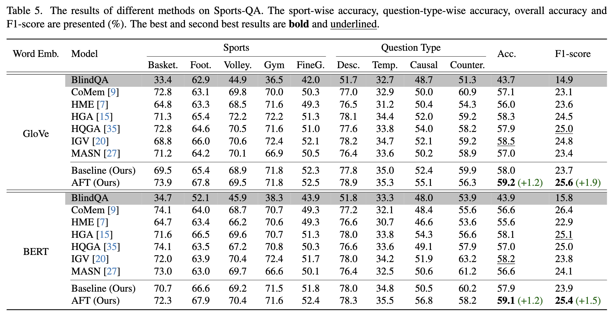

# Sports-QA: A Large-Scale Video Question Answering Benchmark for Complex and Professional Sports

[Haopeng Li](https://hoplee6.github.io/)<sup>1</sup>, [Andong Deng](https://dengandong.github.io/)<sup>2</sup>, [Qiuhong Ke](https://research.monash.edu/en/persons/qiuhong-ke)\*<sup>3</sup>, [Jun Liu](https://scholar.google.com/citations?user=Q5Ild8UAAAAJ)*<sup>4</sup>, [Hossein Rahmani](https://sites.google.com/view/rahmaniatlu)<sup>5</sup>, [Yulan Guo](http://www.yulanguo.cn/)<sup>6</sup>, [Bernt Schiele](http://www.mpi-inf.mpg.de/~schiele)<sup>7</sup>, [Chen Chen](https://www.crcv.ucf.edu/chenchen/)<sup>2</sup>

*<sup>1</sup>University of Melbourne, <sup>2</sup>University of Central Florida, <sup>3</sup>Monash University,
<sup>4</sup>Singapore University of Technology and Design, <sup>5</sup>Lancaster University, <sup>6</sup>Sun Yat-sen University, <sup>7</sup>Max Planck Institute for Informatics*


[](https://arxiv.org/abs/2401.01505)   [](https://unimelbcloud-my.sharepoint.com/:b:/g/personal/haopengl1_student_unimelb_edu_au/ET7YjGlNeBtJps4QHVaOMHMByAe1bU4-k19Jt6Fzl-UPgA?e=RwCY1P)


## Introduction

Reasoning over sports videos for question answering is an important task with numerous applications, such as player training and information retrieval. However, this task has not been explored due to the lack of relevant datasets and the challenging nature it presents. Most datasets for video question answering (VideoQA) focus mainly on general and coarse-grained understanding of daily-life videos, which is not applicable to sports scenarios requiring **professional action understanding and fine-grained motion analysis**. In this paper, we introduce the first dataset, named **Sports-QA**, specifically designed for the sports VideoQA task. The Sports-QA dataset includes various types of questions, such as **descriptions, chronologies, causalities, and counterfactual conditions**, covering **multiple sports**.

## Dataset Statistics

**The numbers of QA pairs for different types and different sports.**

|                | Descriptive  | Temporal  | Causal | Counterfactual | Total  |
|----------------|--------:|--------:|--------:|----------:|--------:|
| Basketball     | 5,629  | 22     | 785    | 278      | 6,714  |
| Football       | 6,659  | 1,355  | 1,949  | 523      | 10,486 |
| Volleyball     | 6,120  | 360    | 1,942  | 685      | 9,107  |
| Gym            | 6,382  | 1,997  | 0      | 0        | 8,379  |
| Floor Exercise | 6,046  | 11,012 | 0      | 0        | 19,418 |
| Balance Beam   | 7,477  | 12,773 | 0      | 0        | 20,250 |
| Uneven Bars    | 7,294  | 12,124 | 0      | 0        | 17,058 |
| Vault          | 2,661  | 0      | 0      | 0        | 2,661  |
| Total          | 48,268 | 39,643 | 4,676  | 1,486    | 94,073 |


## Examples

**Examples from Sports-QA.**


## Benchmark

**Benchmark on Sports-QA**




## Download

*Coming soon!*


## Citation

If you find our work useful in your research, please consider giving a star and citation.

```
@article{li2024sports,
  title={Sports-QA: A Large-Scale Video Question Answering Benchmark for Complex and Professional Sports},
  author={Li, Haopeng and Deng, Andong and Ke, Qiuhong and Liu, Jun and Rahmani, Hossein and Guo, Yulan and Schiele, Bernt and Chen, Chen},
  journal={arXiv preprint arXiv:2401.01505},
  year={2024}
}
```


## Acknowledgement

This work is built on many amazing research works and open-source projects, thanks a lot to all the authors for sharing!

- [MultiSports](https://deeperaction.github.io/datasets/multisports.html): A Multi-Person Video Dataset of Spatio-Temporally Localized Sports Actions
- [FineGym](https://sdolivia.github.io/FineGym/): A Hierarchical Video Dataset for Fine-grained Action Understanding
- [IGV](https://github.com/yl3800/IGV): Invariant Grounding for Video Question Answering


## Contact

For further questions, please contact Haopeng Li (haopeng.li@student.unimelb.edu.au).